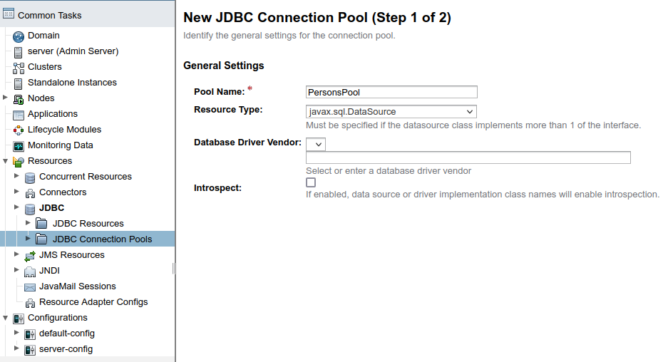
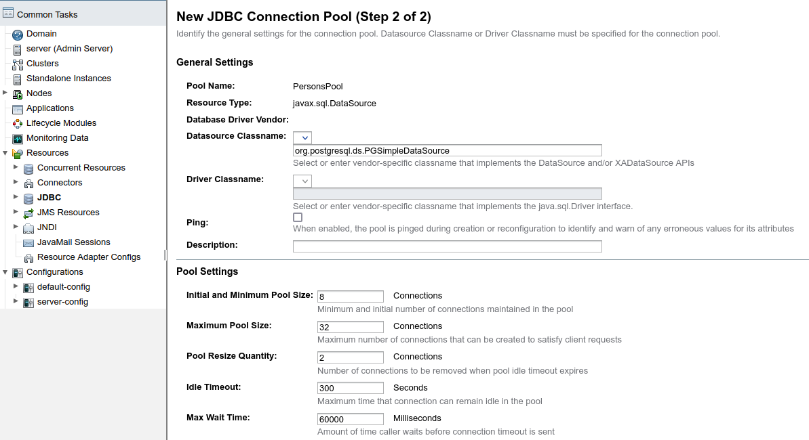
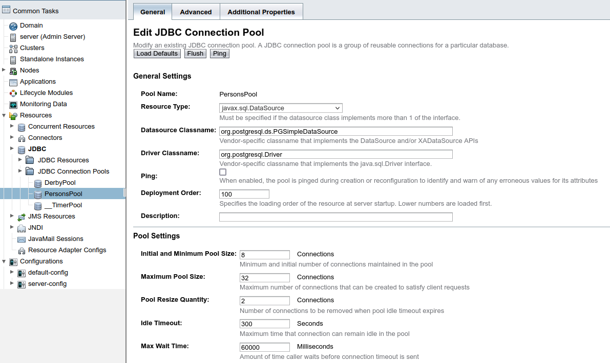
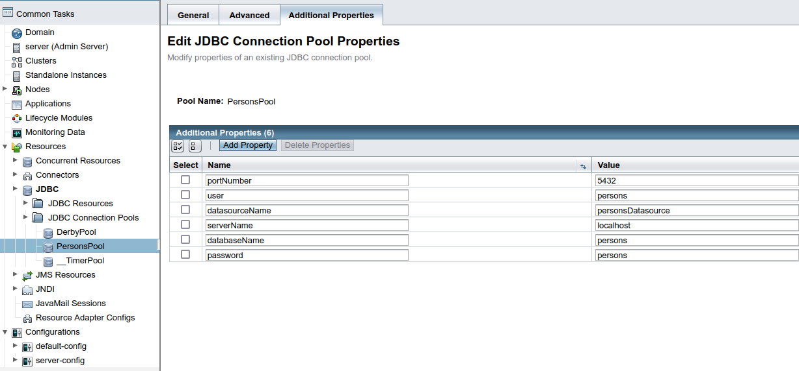
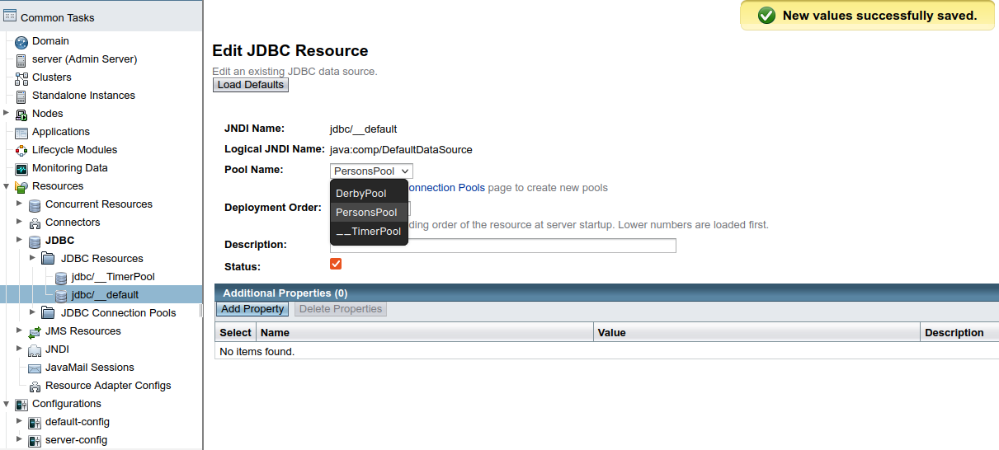
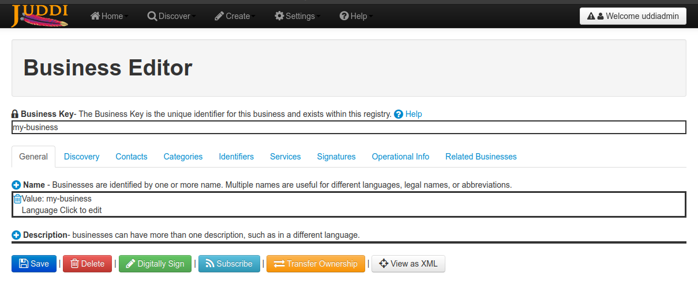

# Person Service

Project that implements labs for the subject "Technologies of Web Services".

To see problem statements refer to methodology materials using the [link][tws_methodology_book] (page 91).
or you can find metodology materials by yourself:
```text
Дергачев А.М., Кореньков Ю.Д., Логинов И.П., Сафронов А.Г., Технологии веб-сервисов– СПб: Университет ИТМО, 2021. – 100 с.
```

## Initializing environment

Install PostgreSQL using Docker Compose

```shell
docker compose up -d
```

Download and install Glassfish

```shell
INSTALL_DIR=$(mktemp -d)
wget -O $INSTALL_DIR/'glassfish-6.2.5.zip' \
    'https://www.eclipse.org/downloads/download.php?file=/ee4j/glassfish/glassfish-6.2.5.zip'
unzip $INSTALL_DIR/glassfish-6.2.5.zip -d $INSTALL_DIR

GLASSFISH_HOME="$INSTALL_DIR/glassfish6"
wget -O $GLASSFISH_HOME/glassfish/lib/postgresql-42.3.5.jar \
    'https://repo1.maven.org/maven2/org/postgresql/postgresql/42.3.5/postgresql-42.3.5.jar'
```

Then you need to add executable to `PATH`

```shell
export PATH="$GLASSFISH_HOME/bin:$PATH"
```

... or make an alias
```shell
alias asadmin="$GLASSFISH_HOME/bin/asadmin"
```

After Glassfish was installed, new domain without password should be created and started

```shell
asadmin create-domain --adminport 4848 --nopassword=true gostev
asadmin start-domain gostev
```

Then open http://localhost:4848 and configure JDBC DataSource

Firstly create new JDBC Connection Pool with given properties:
- Pool Name: `PersonsPool`
- Resource Type: `javax.sql.DataSource`



In the second step set Datasource Classname to `org.postgresql.ds.PGSimpleDataSource` 



After you successfully created new JDBC Connection Pool, open it and set Driver Classname to `org.postgresql.Driver` 



And also set additional properties:
- `datasourceName` with value `personsDatasource`
- `serverName` with value `localhost`
- `portNumber` with value `5432`
- `databaseName` with value `persons`
- `user` with value `persons`
- `password` with value `persons`



Then go to JDBC Resources and open up `jdbc/__default`. Set Pool Name to `PersonPool`.



After JDBC Resource has been configured, build artifacts:

```shell
git clone https://github.com/Pihanya/web-services-labs web-services-technologies-gostev
cd web-services-technologies-gostev
./gradlew build

git clone https://github.com/eclipse/transformer.git transformer
git config --global --add safe.directory $PWD/transformer
cd transformer
git checkout 0.4.0
mvn package
cd -
```

---

## Deploying services

Deploy JAX WS service

```shell
VERSION=$(awk -F= '$1=="version"{print $2}' gradle.properties)
WAR_FILENAME="jaxws-j2ee-${VERSION}.war"

./gradlew build
asadmin undeploy ${WAR_FILENAME%.*} 2> /dev/null >&2 || true
asadmin deploy \
    --contextroot '/jaxws' \
    jax-ws-service/bundles/j2ee/build/libs/${WAR_FILENAME}
```

Deploy REST service

```shell
VERSION=$(awk -F= '$1=="version"{print $2}' gradle.properties)
WAR_FILENAME="replaced-rest-j2ee-${VERSION}.war"
TRANSFORMER_CLI="$PWD/transformer/org.eclipse.transformer.cli/target/org.eclipse.transformer.cli-0.4.0.jar"

./gradlew build
$TRANSFORMER_CLI --overwrite \
    rest-service/bundles/j2ee/build/libs/rest-j2ee-${VERSION}.war \
    rest-service/bundles/j2ee/build/libs/${WAR_FILENAME}
    
asadmin undeploy ${WAR_FILENAME%.*} 2> /dev/null >&2 || true
asadmin deploy \
    --contextroot '/rest' \
    rest-service/bundles/j2ee/build/libs/${WAR_FILENAME}
```

---

## Install CLIs

Install JAX WS CLI
```shell
VERSION=$(awk -F= '$1=="version"{print $2}' gradle.properties)
ARCHIVE_ID="cli-$VERSION"
JAXWS_INSTALL_DIR=$(mktemp -d)
TEMP_DIR=$(mktemp -d)

./gradlew build
unzip -q "jax-ws-service/bundles/cli/build/distributions/$ARCHIVE_ID.zip" -d "$TEMP_DIR"
rsync --remove-source-files -r "$TEMP_DIR"/"$ARCHIVE_ID"/* "$JAXWS_INSTALL_DIR"

alias jaxws_cli="$JAXWS_INSTALL_DIR/bin/cli"
```

Install REST CLI
```shell
VERSION=$(awk -F= '$1=="version"{print $2}' gradle.properties)
ARCHIVE_ID="cli-$VERSION"
REST_INSTALL_DIR=$(mktemp -d)
TEMP_DIR=$(mktemp -d)

./gradlew build
unzip -q "rest-service/bundles/cli/build/distributions/$ARCHIVE_ID.zip" -d "$TEMP_DIR"
rsync --remove-source-files -r "$TEMP_DIR"/"$ARCHIVE_ID"/* "$REST_INSTALL_DIR"

alias rest_cli="$REST_INSTALL_DIR/bin/cli"
```

## Use CLIs

Use JAX WS CLI
```shell
# Create person
jaxws_cli create \
    --first-name 'Mikhail' \
    --second-name 'Gostev' \
    --birth-place 'Human Intertaiment' \
    --birth-date 1999-05-09

# Find person
jaxws_cli find --second-name 'Gostev'

# Update person
jaxws_cli update --id 1 --birth-place 'Saint Petersburg'
    
# Remove person
jaxws_cli remove --id 1
```

Use REST CLI
```shell
# Create person
rest_cli create \
    --first-name 'Mikhail' \
    --second-name 'Gostev' \
    --birth-place 'Human Intertaiment' \
    --birth-date 1999-05-09

# Find person
rest_cli find --second-name 'Gostev'

# Update person
rest_cli update --id 1 --birth-place 'Saint Petersburg'
    
# Remove person
rest_cli remove --id 1
```

---

## Lab 7. Publish and browse jUDDI services

### Initializing environment

Install SDKMAN and JDK 8

```shell
curl -s "https://get.sdkman.io" | bash
source "$HOME/.sdkman/bin/sdkman-init.sh"
sdk install java 8.0.332-tem
sdk install java 17.0.3-tem
```

### Installing jUDDI

Open a separate terminal window.
Install and start jUDDI

```shell
sdk use java 8.0.332-tem

INSTALL_DIR=$(mktemp -d)
UDDI_ARCHIVE=$INSTALL_DIR/'juddi-distro-3.3.10.zip'
wget -O $UDDI_ARCHIVE 'https://dlcdn.apache.org/juddi/juddi/3.3.10/juddi-distro-3.3.10.zip'
unzip $UDDI_ARCHIVE -d $INSTALL_DIR
rm $UDDI_ARCHIVE

UDDI_HOME=$INSTALL_DIR/juddi-distro-3.3.10/juddi-tomcat-3.3.10

SETENV_FILE="${JUDDI_HOME}/${UDDI_HOME}/bin/setenv.sh"
echo 'export JAVA_OPTS="-Djavax.xml.accessExternalDTD=all"' > ${SETENV_FILE}
chmod +x ${SETENV_FILE}

${JUDDI_HOME}/${UDDI_HOME}/bin/startup.sh # use shutdown.sh to stop jUDDI
```

jUDDI Web GUI will be available by the URL: http://localhost:8080/juddi-gui/home.jsp
Login with credentials: `uddiadmin`/`da_password1`

Configure a new business entity with key `my-business`.



### Installing CLI

Open a separate terminal window.
Build and install jUDDI CLI

```shell
sdk use java 17.0.3-tem

VERSION=$(awk -F= '$1=="version"{print $2}' gradle.properties)
ARCHIVE_ID="juddi-cli-$VERSION"
JUDDI_CLI_INSTALL_DIR=$(mktemp -d)
TEMP_DIR=$(mktemp -d)

./gradlew build
unzip -q "juddi-cli/build/distributions/$ARCHIVE_ID.zip" -d "$TEMP_DIR"
rsync --remove-source-files -r "$TEMP_DIR"/"$ARCHIVE_ID"/* "$JUDDI_CLI_INSTALL_DIR"

alias juddi_cli="$JUDDI_CLI_INSTALL_DIR/bin/juddi-cli"
```

Use jUDDI CLI
```shell
# Publish service
juddi_cli publish \
    --business-key my-business \
    --service-name inquiry \
    --wsdl-url http://localhost:8080/juddiv3/services/inquiryv2\?wsdl

# Browse service
juddi_cli find --service-name inquiry
```

[tws_methodology_book]: https://books.ifmo.ru/file/pdf/2740.pdf
